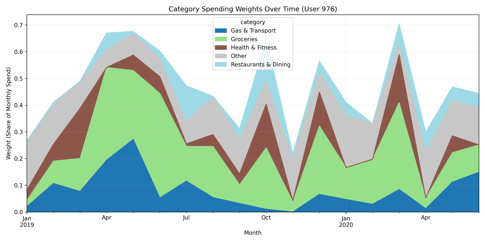
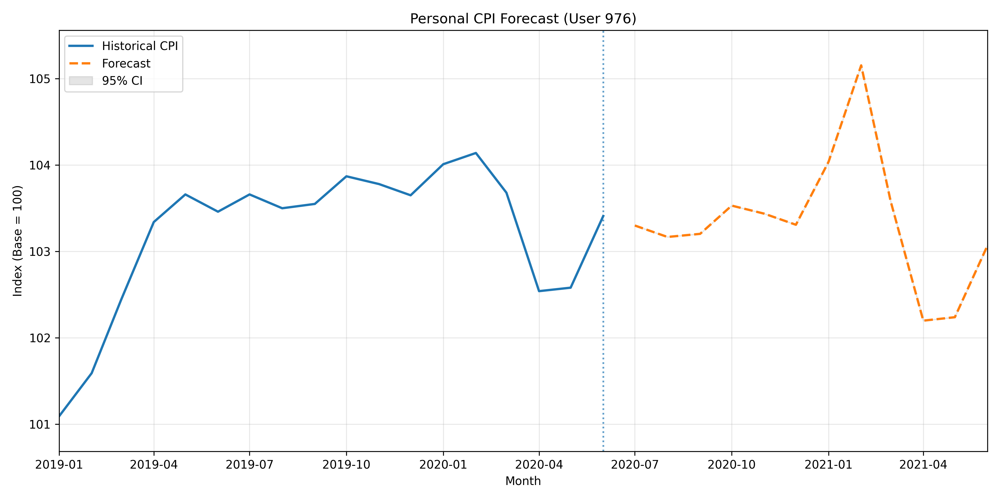

# 📈 Personal CPI Inflation Tracker  

**Built with Python, SQL, BLS API, and Streamlit**

This project computes a **Personalized Consumer Price Index (CPI)** for each user based on their unique spending behavior.
Instead of relying on the national “CPI-U,” this system builds a user-specific inflation index using:

- Cleaned transaction data
- Fixed-weight category baskets (Laspeyres method)
- Normalized CPI data from the BLS
- SARIMAX forecasting models
- An interactive Streamlit dashboard

This behaves like a miniature quant research pipeline: data engineering → economic modeling → time-series forecasting → visualization.

# ⭐ Features

### **1. Transaction Ingestion & Cleaning**
- Load multi-user transaction CSVs  
- Clean timestamps, categories, and amounts  
- Store clean data in `transactions_raw`

---

### **2. SQL-Based CPI Weight Modeling**
- Map raw categories → CPI-like buckets  
- Compute monthly spending weights  
- Identify each user’s base month  
- Build fixed Laspeyres weights, same method used for official CPI

---

### **3. Official CPI Fetch & Normalization**
- Pull CPI time-series from the BLS API 
- Normalize each category’s index to base = 100 
- Store results in `cpi_series` and `cpi_norm`

---

### **4. Personalized CPI Computation**
- Combine user weights with normalized CPI
- Generate multi-user time series stored in personal_index

---

### **5. SARIMAX Forecasting**
- Fit SARIMAX(1,1,1)x(0,1,1,12) per user 
- Fallback to naive forecasts for short histories  
- Save 12-month forecasts with confidence bands

---

### **6. Interactive Streamlit Dashboard**
Includes:
- Personal CPI vs official CPI-U  
- Category weight evolution  
- CPI forecast  
- “What-if” scenario tool (e.g., gas +20%)  
- Random User Selector 
- Preview of recent transactions


# 📊 Example Visualizations


## 1️⃣ Personal CPI vs Official CPI-U  

*Shows whether your inflation moves differently than national CPI-U*


## 2️⃣ Category Spending Weights Over Time  

*Highlights how grocery, gas, dining, shopping, and other categories shift over time.*




## 3️⃣ Personal CPI Forecast with Confidence Intervals  

*Predicts personal inflation for the next 6–12 months with confidence intervals.*



# 🧠 Why This Project Matters

Official CPI uses fixed category weights (Shelter ~34%, Energy ~7%, Food ~13%). 
But your spending is different so your inflation is different.

This project captures that by computing:

- Your personal inflation exposure
- The categories driving your cost of living
- Forward-looking CPI projections

It mirrors how analysts build:

- Custom inflation baskets
- Household CPI indexes
- Real return calculations
- Regional inflation models

# 🏗️ Technology Stack

### **Python:** pandas, SQLAlchemy, statsmodels (SARIMAX), Plotly, Streamlit
### **SQL:** SQLite, window functions, category mapping, weight calculations
### **APIs:** BLS CPI API
### **Visualization:** Matplotlib & Streamlit interactive dashboards


# 📁 **Project Architecture**

```bash
.
├── data/raw/                     # Raw transaction CSVs
├── src/
│   ├── etl_transactions.py       # Load & clean raw data
│   ├── categorize_sql.sql        # Map to CPI-like categories
│   ├── index_sql.sql             # Compute category weights + base weights
│   ├── Personal_cpi_sql.sql      # Normalize CPI + compute personal CPI
│   ├── bls_api.py                # Fetch official CPI from BLS API
│   ├── forecast.py               # SARIMAX forecasts per user
│   ├── make_charts.py            # Static visualization
│   └── app.py                    # Streamlit dashboard
├── charts/                       # PNG visualizations
├── DB/personal_cpi.db            # SQLite database
├── .env                          # DB_URL and (optional) BLS_API_KEY
├── requirements.txt
└── README.md
```

# ⚙️ **Setup Instructions**


```bash
1. Clone the repository

git clone https://github.com/YOUR-USERNAME/Personal-CPI-Tracker.git
cd Personal-CPI-Tracker

2. Create a virtual environment

python3 -m venv .venv
source .venv/bin/activate

3. Install dependencies

pip install -r requirements.txt

4. Create your .env file

Inside the root directory:

DB_URL=sqlite:///personal_cpi.db
BLS_API_KEY=your_key_here 

5. Load raw transactions

python src/etl_transactions.py

6. Run SQL preprocessing

Open your DB and run:

    categorize.sql

    weights.sql

    cpi_math.sql

7. Pull CPI data

python src/bls_api.py

8. Generate Forecasts

python src/forecast.py

9. Run the dashboard

streamlit run src/dashboard.py